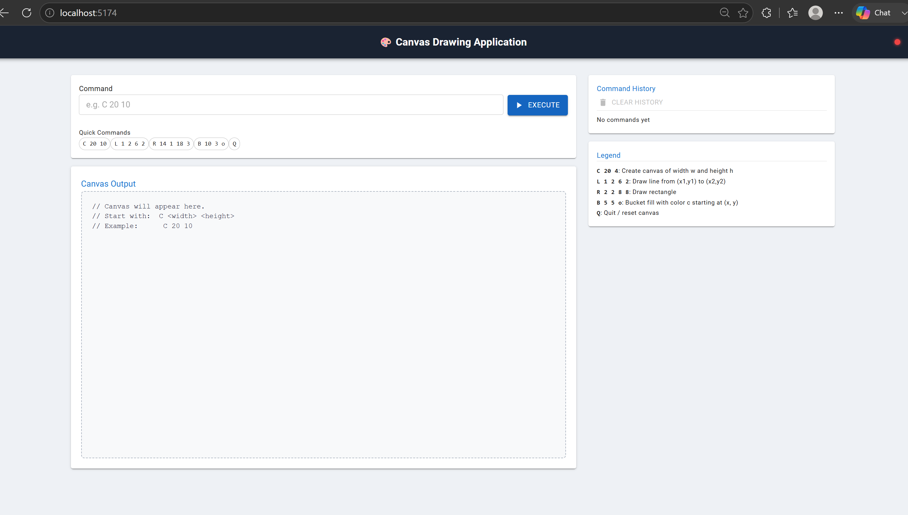

# 🎨 Canvas Drawing Application

A full-stack ASCII canvas drawing application with a **Spring Boot** backend and **React + Vite** frontend.

---

## 📋 Prerequisites

| Tool        | Minimum Version                               |
|-------------|-----------------------------------------------|
| Java (JDK)  | 21                                            |
| Node.js     | 20.13.1                                       |
| npm         | 10.8.0                                        |
| Git         | any                                           |
| curl        | any (used by start scripts for health checks) |

## 🚀 One-command startup

### Windows
```in Git bash
./start.sh
```
```bat
in CMD:
start.bat
```

### Linux / macOS
```bash
chmod +x start.sh
./start.sh
```

Both scripts will:
1. Build the backend (`./gradlew clean build -x test`)
2. Start Spring Boot (`bootRun`) in the background
3. Wait for the backend health check to pass
4. Install frontend dependencies (if not already installed)
5. Start the Vite dev server on port 5174

## 🛠️ Setup Guide

### Architecture

```
canvas-app/
├── canvas-backend/     # Spring Boot 4 (Java 21) — REST API on port 8080
├── canvas-frontend/    # React 18 + Vite + MUI  — Dev server on port 5174
├── start.bat           # One-click startup (Windows)
├── start.sh            # One-click startup (Linux / macOS)
└── README.md           # Project overview + setup guide
```

### URLs

| Service       | URL                                              |
|---------------|--------------------------------------------------|
| Frontend      | http://localhost:5174                            |
| Backend API   | http://localhost:8080                            |
| Swagger UI    | http://localhost:8080/swagger-ui/index.html      |
| Health Check  | http://localhost:8080/actuator/health            |

### Supported Commands

| Command            | Description                                      |
|--------------------|--------------------------------------------------|
| `C <w> <h>`        | Create a canvas of width `w` and height `h`      |
| `L <x1> <y1> <x2> <y2>` | Draw a horizontal or vertical line         |
| `R <x1> <y1> <x2> <y2>` | Draw a rectangle                           |
| `B <x> <y> <c>`    | Flood-fill from `(x, y)` with colour `c`         |
| `Q`                | Quit / reset the canvas                          |

#### Example session
```
C 20 5        → creates a 20×5 canvas
L 1 1 20 1    → draws top horizontal line
R 5 2 10 4    → draws a rectangle
B 1 3 o       → fills background with 'o'
Q             → resets canvas
```

### Running Tests

#### Backend (Java — JUnit 5 + Mockito)
```bash
cd canvas-backend
./gradlew test                    # run tests
./gradlew test jacocoTestReport   # run tests + coverage report
```
Coverage report: `canvas-backend/build/reports/tests/test/index.html`
JaCoCo report:   `canvas-backend/build/reports/jacoco/test/html/index.html`

> Minimum coverage threshold: **70%** (enforced by `jacocoTestCoverageVerification`)

#### Frontend (TypeScript — Vitest + Testing Library)
```bash
cd canvas-frontend
npm test              # watch mode
npm run test:coverage # single run + coverage report
npm run test:ci       # CI mode (verbose output)
```
Coverage report: `canvas-frontend/coverage/index.html`

> Minimum coverage threshold: **70%** (lines / functions / branches / statements)

### Tech Stack

| Layer     | Technology                                   |
|-----------|----------------------------------------------|
| Backend   | Java 21, Spring Boot 4, Gradle, JaCoCo       |
| Frontend  | React 18, TypeScript, Vite, MUI v9           |
| API Docs  | Springdoc OpenAPI 3 (Swagger UI)             |
| Testing   | JUnit 5, Mockito, Vitest, Testing Library    |
| Security  | Spring Security (CSRF disabled, CORS configured) |

### Extra details

**Java 21**

Windows:
```bat
winget install Microsoft.OpenJDK.21
```

macOS:
```bash
brew install --cask temurin@21
```

Linux (Ubuntu / Debian):
```bash
sudo apt update
sudo apt install -y openjdk-21-jdk
```

**Node.js 20+ and npm 9+**

Windows:
```bat
winget install OpenJS.NodeJS.LTS
```

macOS:
```bash
brew install node
```

Linux (Ubuntu / Debian):
```bash
curl -fsSL https://deb.nodesource.com/setup_20.x | sudo -E bash -
sudo apt install -y nodejs
```

**Git**

Windows:
```bat
winget install Git.Git
```

macOS:
```bash
brew install git
```

Linux:
```bash
sudo apt install -y git
```

**curl**

Windows and macOS include curl by default. On Linux:
```bash
sudo apt install -y curl
```

### Clone the repository

```bash
git clone <repository-url>
cd canvas-app
```

### Manual setup — backend

```bash
cd canvas-backend
chmod +x gradlew   # Linux / macOS only

./gradlew clean build -x test   # Linux / macOS
gradlew.bat clean build -x test  # Windows

./gradlew bootRun                # Linux / macOS
gradlew.bat bootRun              # Windows
```

Verify:
```bash
curl http://localhost:8080/actuator/health
```

### Manual setup — frontend

```bash
cd canvas-frontend
npm install
npm start
```

Verify:
```text
Open http://localhost:5174 in your browser.
```

### One-command startup

Windows:
```bat
start.bat
```

Linux / macOS:
```bash
chmod +x start.sh
./start.sh
```

### Troubleshooting

| Problem | Solution |
|---------|----------|
| `gradlew: Permission denied` | Run `chmod +x canvas-backend/gradlew` |
| Port 8080 already in use | Kill existing process using port 8080 |
| Port 5174 already in use | Stop the process using 5174 or change the Vite port in `canvas-frontend/vite.config.ts` |
| `JAVA_HOME not set` | Set `JAVA_HOME` to your JDK 21 install path and add `$JAVA_HOME/bin` to `PATH` |
| Backend build fails | Check `backend-build.log` in the project root |
| Frontend won't start | Check `frontend.log` in the project root, or run `npm install` manually |
| `curl` not found (Linux) | Run `sudo apt install curl` |

